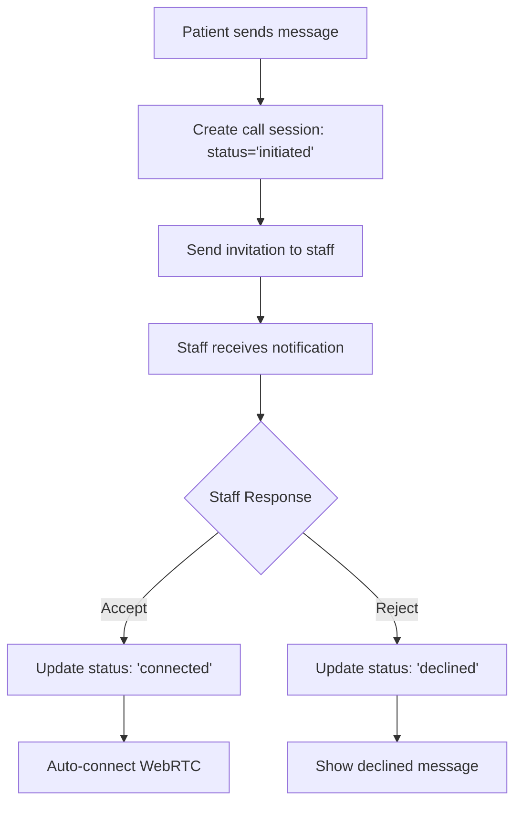
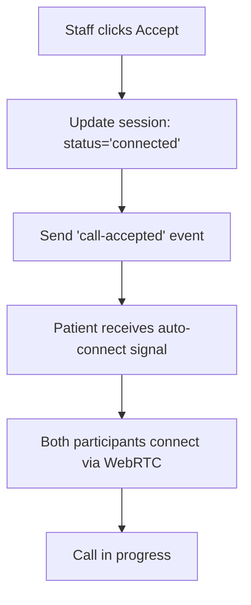

# 🔄 Improved Video Call Flow Documentation

## Overview
This document describes the improved systematic video call flow that fixes the "preparing call" issue and ensures proper navigation and connection between patients and staff.

## 🎯 Problems Fixed

### ❌ **Previous Issues:**
- Staff would see "preparing call" indefinitely after accepting
- No automatic connection after staff acceptance
- Poor navigation flow and button controls
- Inconsistent call status updates
- No systematic flow management

### ✅ **Solutions Implemented:**
- **Automatic Connection** - Staff acceptance immediately triggers connection
- **Systematic Flow** - Clear status progression: initiated → ringing → connected
- **Real-time Updates** - Live status updates for both participants
- **Improved Navigation** - Proper back buttons and call controls
- **Better UX** - Clear visual feedback and loading states

## 🚀 New API Endpoints

### 1. Call Connection Management

#### `POST /api/video-call/connect`
Centralized call flow management with systematic progression.

**Actions:**
- `accept` - Staff accepts call (auto-connects)
- `reject` - Staff rejects call
- `start_call` - Patient starts the call
- `end_call` - Either participant ends call

**Request Body:**
```json
{
  "conversationId": "string",
  "sessionId": "uuid",
  "action": "accept" | "reject" | "start_call" | "end_call",
  "metadata": {}
}
```

**Response:**
```json
{
  "success": true,
  "session": {
    "id": "uuid",
    "status": "connected",
    "caller_id": "string",
    "callee_id": "string",
    "call_type": "video",
    "metadata": {
      "auto_connect": true,
      "accepted_at": "timestamp"
    }
  },
  "action": "accepted",
  "timestamp": "timestamp"
}
```

### 2. Real-time Events

#### **New Events:**
- `call-accepted` - Staff accepts call (triggers auto-connect)
- `call-rejected` - Staff rejects call
- `call-ringing` - Call is ringing
- `call-ended` - Call ended by either participant

#### **Event Payload:**
```json
{
  "session_id": "uuid",
  "conversation_id": "string",
  "caller_id": "string",
  "callee_id": "string",
  "action": "accept" | "reject" | "start_call" | "end_call",
  "auto_connect": true,
  "timestamp": "timestamp",
  "metadata": {}
}
```

## 🔄 Systematic Call Flow

### **1. Patient Initiates Call:**


### **2. Staff Accepts Call:**


### **3. Call Status Progression:**
```
initiated → ringing → connected → ended
    ↓         ↓         ↓         ↓
  Patient   Staff     Both     Either
  waiting   ringing   active   ends
```

## 🎨 UI Components

### **CallFlowManager Component**
Handles the complete call flow with proper navigation and controls.

**Features:**
- ✅ **Status Display** - Clear visual status indicators
- ✅ **Action Buttons** - Context-appropriate controls
- ✅ **Loading States** - Proper feedback during actions
- ✅ **Error Handling** - Graceful error recovery
- ✅ **Real-time Updates** - Live status synchronization

**Props:**
```typescript
interface CallFlowManagerProps {
  conversationId: string;
  userId: string;
  userRole: "patient" | "staff";
  onCallStart: () => void;
  onCallEnd: () => void;
  onNavigateBack: () => void;
}
```

### **Improved Call Page**
Enhanced call interface with systematic flow integration.

**Features:**
- ✅ **Header Navigation** - Back button and user info
- ✅ **Status Badges** - Visual call status indicators
- ✅ **Call Controls** - Mute, video, screen share, end call
- ✅ **Real-time Sync** - Live updates from other participant
- ✅ **Responsive Design** - Works on all devices

## 📱 Usage Examples

### **Patient Initiating Call:**
```javascript
// 1. Patient sends message with auto-initiate
const response = await fetch('/api/patient/video-call-message', {
  method: 'POST',
  headers: { 'Content-Type': 'application/json' },
  body: JSON.stringify({
    conversationId: 'conv-123',
    message: 'I need to discuss my treatment',
    callType: 'video',
    autoInitiateCall: true
  })
});

// 2. Patient navigates to call page
router.push(`/call-improved/${conversationId}`);
```

### **Staff Accepting Call:**
```javascript
// 1. Staff receives notification and clicks accept
const response = await fetch('/api/video-call/connect', {
  method: 'POST',
  headers: { 'Content-Type': 'application/json' },
  body: JSON.stringify({
    conversationId: 'conv-123',
    action: 'accept'
  })
});

// 2. Both participants automatically connect
// WebRTC connection is established immediately
```

### **Real-time Event Handling:**
```javascript
// Listen for call events
const channel = supabase.channel(`call-updates-${conversationId}`);

channel
  .on('broadcast', { event: 'call-accepted' }, (payload) => {
    // Auto-connect WebRTC
    establishWebRTCConnection();
  })
  .on('broadcast', { event: 'call-rejected' }, (payload) => {
    // Show rejection message
    showCallRejected();
  })
  .on('broadcast', { event: 'call-ended' }, (payload) => {
    // Clean up and return to messages
    endCall();
  })
  .subscribe();
```

## 🔧 Integration Steps

### **1. Update Existing Call Pages:**
Replace the current call page with the improved version:
```typescript
// Use the new improved call page
import ImprovedCallPage from '@/app/call-improved/[conversationId]/page';

// Or integrate CallFlowManager into existing page
import CallFlowManager from '@/components/call/CallFlowManager';
```

### **2. Update API Calls:**
Use the new centralized connection API:
```typescript
// Instead of multiple API calls, use single endpoint
const response = await fetch('/api/video-call/connect', {
  method: 'POST',
  body: JSON.stringify({
    conversationId,
    action: 'accept' // or 'reject', 'start_call', 'end_call'
  })
});
```

### **3. Add Real-time Subscriptions:**
Listen for the new events:
```typescript
const channel = supabase.channel(`call-updates-${conversationId}`);
channel
  .on('broadcast', { event: 'call-accepted' }, handleCallAccepted)
  .on('broadcast', { event: 'call-rejected' }, handleCallRejected)
  .on('broadcast', { event: 'call-ended' }, handleCallEnded)
  .subscribe();
```

## 🎯 Benefits

### **For Patients:**
- ✅ **Clear Status** - Always know what's happening
- ✅ **Easy Navigation** - Simple back button to messages
- ✅ **Automatic Connection** - No waiting in "preparing" state
- ✅ **Better UX** - Intuitive controls and feedback

### **For Staff:**
- ✅ **Instant Connection** - Accept button immediately connects
- ✅ **Clear Actions** - Know exactly what each button does
- ✅ **Real-time Updates** - See patient actions immediately
- ✅ **Proper Navigation** - Easy return to message list

### **For Developers:**
- ✅ **Systematic Flow** - Clear, predictable call progression
- ✅ **Centralized API** - Single endpoint for all call actions
- ✅ **Real-time Events** - Consistent event handling
- ✅ **Better Error Handling** - Graceful failure recovery

## 🚀 Next Steps

1. **Deploy the new APIs** - `/api/video-call/connect`
2. **Update frontend** - Use `CallFlowManager` component
3. **Test the flow** - Verify systematic progression
4. **Monitor performance** - Ensure real-time updates work
5. **Gather feedback** - Get user input on improved UX

The improved call flow ensures a smooth, systematic experience for both patients and staff with proper navigation and automatic connection! 🎉
